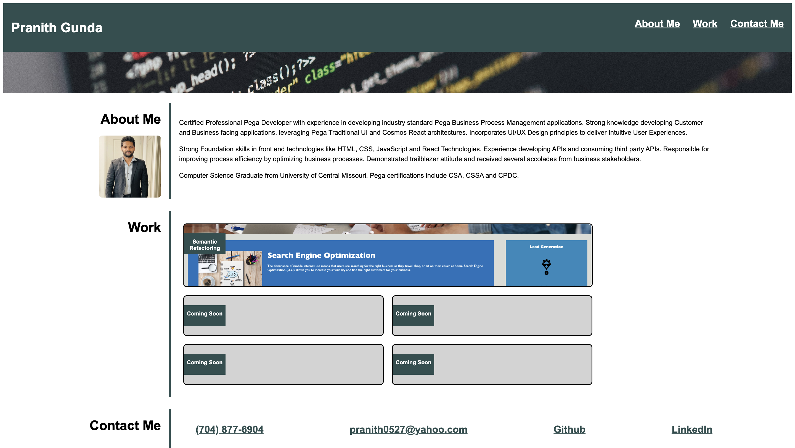

# Portfolio

## Description

Project motive is to build Portfolio, to showcase my skills and achievements, so I can target potential employers for Job opportunities. In todays challenging world an impressive portfolio, showcasing the background and projects will open doors for many employment opportunities and serves as a foundation step for getting employed. The portfolio will be maintained and enhanced further, adding new projects as they become available.

Developing portfolio gave me an opportunity, to implement the advanced CSS skills, I have learn't so far. In this project, I primarily used Flexbox, Media Queries and CSS Variables. I tested my portfolio page under different screen resolutions and impressed with the page adaptability.

After implementing this portfolio, I am now more confident on how to structure webpages using HTML and apply CSS to beautify it.

## Portfolio Screenshot

## Link to deployed site

Coming Soon

